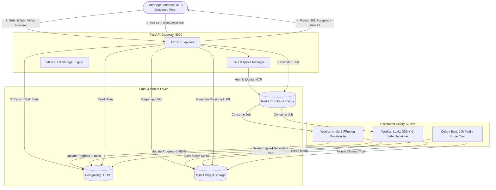

# VanishLab

<div align="center">


**High-Performance AI Watermark Remover & Clean Media Downloader**

[](https://fastapi.tiangolo.com)
[](https://flutter.dev)
[](https://docs.celeryq.dev)
[](https://onnxruntime.ai)
[](LICENSE)

</div>

---

## 🌟 Overview

**VanishLab** adalah platform terintegrasi full-stack berskala produksi untuk membersihkan watermark dari media foto dan video berbasis AI deep learning, serta mengunduh media bersih tanpa watermark dari platform populer seperti TikTok, Instagram Reels, YouTube Shorts, dan Twitter/X.

Dibangun dengan arsitektur mikroservis terdistribusi (*asynchronous task queue*) yang mampu menangani beban pemrosesan komputasi video berat tanpa memblokir server API, dilengkapi splash screen 3D dinamis, sistem onboarding interaktif, dan layanan backend otomatis di latar belakang.

---

## ✨ Fitur Utama

### 1. 🖼️ AI Image Watermark Remover
- **Multi-Tool Precision Canvas**: Dukungan *Brush*, *Drag Box*, dan *Lasso Polygon* untuk memilih watermark teks, logo, atau objek.
- **Deep Learning Inpainting (LaMa ONNX)**: Menggunakan model *Large Mask Inpainting* dengan resolusi tinggi dan tekstur latar belakang sintetis yang mulus tanpa blur cacat.
- **Interactive Before/After Slider**: Membandingkan hasil gambar asli dan gambar bersih secara langsung dengan slider interaktif.

### 2. 🎬 AI Video Watermark Remover
- **Live Frame Preview Extraction**: Mengekstrak frame cuplikan video asli secara instan (`POST /api/v1/inpaint/video/preview`) dengan rasio aspek dinamis (16:9, 9:16 vertical TikTok/Reels, 1:1 square).
- **Visual Inpainting Overlays**:
  - **Corner Presets**: Menghapus watermark di sudut (Bottom-Right, Top-Left, dll.).
  - **Bouncing Watermark Preset (`tiktok_both`)**: Menghapus watermark TikTok yang berpindah-pindah posisi di sudut atas-kiri dan bawah-kanan secara simultan.
  - **Custom Draggable Box**: Memposisikan kotak seleksi interaktif dengan slider persentase.
  - **Direct Brush on Video Frame**: Menggambar mask bebas langsung di atas video frame asli.
- **Pristine Quality Preservation**: Menjaga kualitas resolusi, 60 FPS asli, dan stream audio lossless tanpa re-encoding yang merusak suara.

### 3. ⚡ Clean Media Downloader
- **Universal URL Hub**: Ekstraksi video bersih dari TikTok, Instagram, YouTube, X/Twitter via `yt-dlp` dan FFmpeg stream processing.
- **Video (MP4) & Audio (MP3)**: Opsi unduh video HD atau konversi langsung ke audio kualitas 320 kbps.
- **Auto-Crop Watermark Bars**: Deteksi dan pemotongan otomatis garis hitam atau margin bertuliskan watermark.

### 4. 🚀 3D Splash Screen & Onboarding
- **3D Animated Splash Screen**: Logo 3D berputar pada sumbu perspektif dengan efek *spring bounce*, pendaran *ambient radial glow*, tipografi gradien brand, dan progress indicator adaptif dengan durasi terkalibrasi 3,6 detik.
- **Interactive Onboarding Screen**: 3 slide pengenalan fitur dengan kartu ilustrasi 3D, chip fitur (*Brush & Custom Box*, *Generative Fill*, *60 FPS Lossless*), indikator halaman kapsul, dan tombol aksi terpadu dengan persistensi preferensi lokal.
- **Standardized 3D App Logo**: Komponen `AppLogo3D` dengan 3 ukuran standar:
  - `small` (32x32 px) pada Top Utility Bar
  - `standard` (72x72 px) pada kartu dan dialog
  - `large` (112x112 px) pada Splash Screen dan Onboarding
- **Modern Adaptive Launcher Icons**: Icon launcher 3D dengan dukungan adaptive icon untuk Android 8.0 hingga Android 16 (`mipmap-anydpi-v26`).

### 5. 🔌 Auto-Run Background API Engine
- **Silent Background Daemon**: Skrip `start_daemon.py` dan `run_silent.vbs` yang menjalankan server Uvicorn secara hening di latar belakang tanpa memunculkan jendela terminal (`CREATE_NO_WINDOW`).
- **Windows Startup Integration**: Opsi pendaftaran ke Windows Startup (`install_autostart.bat`) agar API otomatis aktif setiap kali komputer menyala.
- **Flutter Native Auto-Spawner**: Pada platform desktop, aplikasi Flutter mendeteksi ketersediaan API dan secara otomatis meluncurkannya di latar belakang.
- **One-Click Runner**: Skrip `start_app_with_backend.bat` untuk menjalankan backend dan frontend sekaligus tanpa terminal tambahan.

### 6. 📊 Real-Time Task Tracker & Quota System
- **Asynchronous Task Polling**: Pelacakan progres pekerjaan (0–100%) dengan status transisi (`queued` → `processing` → `completed` / `failed`).
- **Presigned Download URLs**: Unduhan file aman dengan masa berlaku sementara.
- **User Quota**: Jatah 50 request gratis harian per user/IP dengan atomic Redis rate limiting.

---

## 🏗️ Arsitektur Sistem



---

## 📁 Struktur Repositori

```text
VanishLab/
├── backend/                        # FastAPI, Celery, AI Inpainting & Downloader Service
│   ├── app/
│   │   ├── api/v1/                 # Endpoints (auth, inpaint, downloader, tasks)
│   │   ├── core/                   # Config, Database, Redis, S3 Storage, Security
│   │   ├── models/                 # SQLAlchemy ORM Models (User, Task, MediaFile)
│   │   ├── schemas/                # Pydantic v2 Request/Response Schemas
│   │   ├── services/               # Inpainting, Video Inpainting, Extractor, Quota, Retention
│   │   └── workers/                # Celery App, Background Worker Tasks, Beat Schedules
│   ├── models_weights/             # Bobot Model AI (big-lama.onnx)
│   ├── scripts/                    # Skrip pengunduh bobot AI dan daemon background
│   ├── run_silent.vbs              # Peluncur backend tanpa terminal
│   ├── docker-compose.yml          # Stack orkestrasi Docker produksi
│   ├── Dockerfile                  # Container backend (FFmpeg, OpenCV, Python 3.11)
│   └── requirements.txt            # Dependensi Python
├── frontend/                       # Aplikasi Klien Flutter (BLoC Pattern)
│   ├── assets/                     # Asset grafis 3D (logo_3d, ilustrasi onboarding)
│   ├── lib/
│   │   ├── core/                   # Tema Dark Mode, Konfigurasi API, Network, Launcher Service
│   │   ├── data/                   # Models & Repositories
│   │   └── presentation/           # BLoC, Halaman (Inpaint, Downloader, Splash, Onboarding)
│   ├── test/                       # Unit & Widget Test Suites
│   └── pubspec.yaml                # Dependensi Flutter
├── postman/                        # Koleksi Postman & Environment siap pakai
├── start_app_with_backend.bat      # Peluncur satu klik (API + Flutter)
├── CHANGELOG.md                    # Riwayat pembaruan & rilis
├── CONTRIBUTING.md                 # Panduan kontribusi & standar kode
├── LICENSE                         # Lisensi Open Source MIT
├── README.md                       # Dokumentasi Utama
└── SECURITY.md                     # Kebijakan keamanan & data retention
```

---

## 🚀 Panduan Memulai Cepat

### Opsi A: Jalankan Seluruh Stack dengan Docker Compose (Direkomendasikan)

Pastikan Docker & Docker Compose telah terpasang di sistem Anda:

```bash
cd backend
cp .env.example .env
docker compose up --build -d
```

Layanan yang aktif:
- **FastAPI Backend**: `http://localhost:8000` (Dokumentasi Swagger: `http://localhost:8000/docs`)
- **MinIO S3 Console**: `http://localhost:9001` (User: `minioadmin` / Pass: `minioadmin`)
- **PostgreSQL**: `localhost:5432`
- **Redis**: `localhost:6379`
- **Celery Worker & Beat**: Menjalankan antrean tugas dan pembersihan berkala otomatis.

---

### Opsi B: Pengembangan Lokal (Manual & Otomatis)

#### 1. Menjalankan Backend:
Untuk menjalankan server secara hening tanpa jendela terminal terbuka:
```bash
wscript.exe backend/run_silent.vbs
```

Atau untuk menjalankan manual dengan log terminal interaktif:
```bash
cd backend
python -m venv .venv
.venv\Scripts\Activate.ps1
pip install -r requirements.txt
cp .env.example .env
python scripts/download_model.py
uvicorn app.main:app --reload --host 0.0.0.0 --port 8000
```

Untuk mendaftarkan backend agar otomatis berjalan saat Windows booting:
```bash
backend\scripts\install_autostart.bat
```

#### 2. Menjalankan Frontend Flutter:
```bash
cd frontend
flutter pub get
flutter run -d emulator-5554
```

Untuk menjalankan di target Windows Desktop atau Web:
```bash
flutter run -d windows
flutter run -d chrome
```

---

## 📡 Ringkasan API Endpoint Utama

| Method | Endpoint | Deskripsi | Autentikasi |
| :--- | :--- | :--- | :---: |
| `POST` | `/api/v1/auth/register` | Pendaftaran akun baru | Publik |
| `POST` | `/api/v1/auth/login` | Login & mendapatkan JWT Bearer Token | Publik |
| `GET` | `/api/v1/auth/quota` | Cek sisa kuota harian & waktu reset | Token / IP |
| `POST` | `/api/v1/downloader/process` | Submit tugas unduh media bersih | Token / IP |
| `POST` | `/api/v1/inpaint/image` | Submit inpainting foto dengan mask | Token / IP |
| `POST` | `/api/v1/inpaint/video/preview` | Ekstraksi cepat frame cuplikan video | Publik |
| `POST` | `/api/v1/inpaint/video` | Submit inpainting pembersihan video | **Wajib Login** |
| `GET` | `/api/v1/tasks/{task_id}` | Polling progres & ambil link unduh S3 | Publik |

---

## 🛡️ Kebijakan Keamanan & Privasi

- **Penyimpanan Sementara 24 Jam**: Seluruh media yang diunggah dan dihasilkan akan dihapus otomatis setelah 24 jam oleh Celery Beat scheduled retention worker.
- **Akses Presigned S3**: File media tidak dapat diakses secara publik; hanya dapat diunduh melalui URL presigned dengan masa aktif terbatas.
- **Proteksi SSRF & Validasi File**: URL downloader diperiksa terhadap IP privat/loopback dan file diverifikasi tipe MIME-nya sebelum diproses.
- Untuk informasi lengkap, baca [SECURITY.md](SECURITY.md).

---

## 🤝 Kontribusi

Tertarik untuk berkontribusi? Silakan baca panduan lengkap pada [CONTRIBUTING.md](CONTRIBUTING.md) sebelum membuka pull request.

---

## 📄 Lisensi

Proyek ini dilisensikan di bawah [Lisensi MIT](LICENSE).
