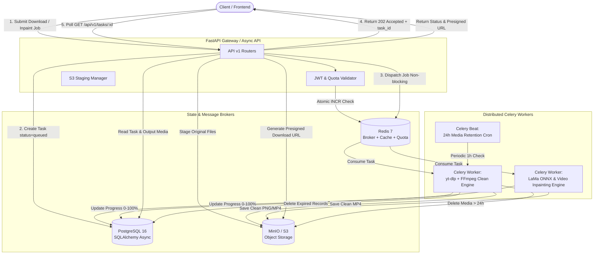

# VanishLab Backend Engine
> **High-Concurrency AI Watermark Remover & Clean Media Downloader**

VanishLab adalah backend berskala produksi yang dirancang khusus untuk memproses pengunduhan media bersih tanpa watermark dan penghapusan watermark gambar serta video berbasis deep learning (LaMa ONNX & Video Inpainting) secara asinkron (*non-blocking*) dan terdistribusi.

---

## 🏗️ 1. Arsitektur Sistem



---

## 📁 2. Struktur Direktori

```text
backend/
├── app/
│   ├── api/
│   │   ├── deps.py                 # Dependency Injection (Auth, DB, Client IP)
│   │   └── v1/
│   │       ├── auth.py             # User Register, Login, Me, Quota Status, Quota Reset
│   │       ├── downloader.py       # POST /api/v1/downloader/process
│   │       ├── inpaint.py          # POST /api/v1/inpaint/image, /inpaint/video/preview, /inpaint/video
│   │       ├── tasks.py            # GET /api/v1/tasks/{task_id} (Polling & Presigned URLs)
│   │       └── router.py           # V1 Router Aggregator
│   ├── core/
│   │   ├── config.py               # Pydantic Settings & Environment Variables
│   │   ├── database.py             # Async & Sync SQLAlchemy Session Management
│   │   ├── exceptions.py           # Standardized Domain Exceptions & Handlers
│   │   ├── redis_client.py         # Async/Sync Redis Connections
│   │   ├── security.py             # Password Hashing (bcrypt) & JWT Auth
│   │   └── storage.py              # MinIO/S3 Client & Presigned URLs
│   ├── models/
│   │   ├── base.py                 # TimeStampedModel Base
│   │   ├── user.py                 # User Model (Daily Quota Tracking)
│   │   ├── task.py                 # Task Model (Status, Progress, Metadata)
│   │   └── media.py                # MediaFile Model (Retention & S3 Keys)
│   ├── schemas/
│   │   ├── auth.py                 # Pydantic v2 Auth Schemas
│   │   ├── common.py               # Standard Response & Error Formats
│   │   ├── downloader.py           # Downloader Request & Task Schemas
│   │   ├── inpaint.py              # Inpainting Request & Task Schemas
│   │   └── task.py                 # Task Progress & Output Schemas
│   ├── services/
│   │   ├── extractor.py            # yt-dlp Clean Extraction & FFmpeg Stream Pipeline
│   │   ├── inpainting.py           # LaMa ONNX Watermark Removal Inference Engine
│   │   ├── video_inpainting.py     # Video Inpainting Engine (Corner Presets, Custom Box, Mask)
│   │   ├── quota.py                # Atomic Quota Rate Limiter (Redis + DB)
│   │   └── retention.py            # S3 & DB 24h Auto-Cleanup Logic
│   ├── workers/
│   │   ├── celery_app.py           # Celery Configuration & Beat Schedule
│   │   └── tasks.py                # Background Tasks Definitions
│   └── main.py                     # FastAPI Application Entrypoint & Healthcheck
├── models_weights/                 # Directory for ONNX Model Weights (e.g. big-lama.onnx)
├── scripts/
│   ├── download_model.py           # Skrip otomatis pengunduh bobot AI LaMa
│   ├── start_daemon.py             # Skrip peluncur silent daemon background
│   ├── stop_daemon.py              # Skrip penghenti silent daemon background
│   ├── install_autostart.bat       # Skrip pendaftaran ke Windows Startup
│   └── uninstall_autostart.bat     # Skrip penghapusan dari Windows Startup
├── run_silent.vbs                  # Peluncur VBScript tanpa jendela terminal
├── docker-compose.yml              # Complete Production Stack Orchestration
├── Dockerfile                      # Production Docker Image (FFmpeg + OpenCV + Py3.11)
├── requirements.txt                # Pinned Modern Dependencies
└── .env.example                    # Environment Variables Documentation
```

---

## 🚀 3. Cara Menjalankan

### Opsi A: Silent Background Mode (Otomatis & Tanpa Terminal)

Untuk menjalankan API secara hening di latar belakang tanpa jendela CMD/terminal:

```bash
wscript.exe backend/run_silent.vbs
```

Untuk mendaftarkan API agar otomatis aktif setiap kali komputer menyala:
Jalankan file `backend/scripts/install_autostart.bat`.

Untuk menghentikan background daemon jika diperlukan:
```bash
python backend/scripts/stop_daemon.py
```

---

### Opsi B: Docker Compose (Direkomendasikan untuk Produksi)

```bash
cd backend
cp .env.example .env
docker compose up --build -d
```

Layanan yang aktif:
- **FastAPI API**: `http://localhost:8000` (Swagger UI: `http://localhost:8000/docs`)
- **MinIO S3 Console**: `http://localhost:9001` (User: `minioadmin` / Pass: `minioadmin`)
- **PostgreSQL**: `localhost:5432`
- **Redis**: `localhost:6379`
- **Celery Worker**: 4 proses konkuren untuk video/AI processing
- **Celery Beat**: Scheduler pembersihan otomatis file > 24 jam

---

### Opsi C: Menjalankan Manual di Terminal

```bash
cd backend
python -m venv .venv
.venv\Scripts\Activate.ps1
pip install -r requirements.txt
cp .env.example .env
python scripts/download_model.py
uvicorn app.main:app --reload --host 0.0.0.0 --port 8000
```

---

## 📡 4. Dokumentasi Endpoint Kunci

### 1. Submit Clean Media Downloader Job
- **URL**: `POST /api/v1/downloader/process`
- **Status Code**: `202 Accepted`
- **Request Body**:
```json
{
  "url": "https://www.tiktok.com/@username/video/1234567890",
  "extract_audio_only": false,
  "crop_watermark_bars": false,
  "max_resolution": "1080p"
}
```
- **Response**:
```json
{
  "task_id": "a92e622b-23eb-46c5-a6e4-e3f7c10b784a",
  "status": "queued",
  "message": "Media extraction job accepted and queued for worker processing.",
  "estimated_time_sec": 15
}
```

---

### 2. Submit AI Image Watermark Inpainting Job
- **URL**: `POST /api/v1/inpaint/image`
- **Content-Type**: `multipart/form-data`
- **Status Code**: `202 Accepted`
- **Form Data**:
  - `image`: File gambar asli (PNG/JPG/WebP)
  - `mask`: File mask biner (Putih = Watermark yang dihapus, Hitam = Area yang dipertahankan)
- **Response**:
```json
{
  "task_id": "8c5eb3c0-6d45-4fd2-8a9d-19069d27f8a7",
  "status": "queued",
  "message": "Inpainting task accepted and queued for worker processing.",
  "estimated_time_sec": 5
}
```

---

### 3. Ekstraksi Live Preview Video
- **URL**: `POST /api/v1/inpaint/video/preview`
- **Content-Type**: `multipart/form-data`
- **Form Data**:
  - `video`: File video (MP4/MOV/WebM)
- **Response**:
```json
{
  "width": 1080,
  "height": 1920,
  "fps": 30.0,
  "duration_sec": 15.2,
  "aspect_ratio": 0.5625,
  "preview_frame_base64": "data:image/jpeg;base64,..."
}
```

---

### 4. Submit AI Video Inpainting Job
- **URL**: `POST /api/v1/inpaint/video`
- **Autentikasi**: Wajib Bearer Token JWT
- **Form Data**:
  - `video`: File video asli
  - `corner_preset`: `bottom_right`, `bottom_left`, `top_right`, `top_left`, atau `tiktok_both`
  - `box_x`, `box_y`, `box_w`, `box_h`: Koordinat kotak kustom (opsional)
  - `mask`: File mask biner kustom (opsional)

---

### 5. Polling Status Pekerjaan & Presigned Download URL
- **URL**: `GET /api/v1/tasks/{task_id}`
- **Response saat Sedang Memproses (`processing`)**:
```json
{
  "task_id": "a92e622b-23eb-46c5-a6e4-e3f7c10b784a",
  "task_type": "download_media",
  "status": "processing",
  "progress": 55,
  "error_message": null,
  "output_files": [],
  "created_at": "2026-10-03T04:30:00Z",
  "updated_at": "2026-10-03T04:30:10Z"
}
```
- **Response saat Selesai (`completed`)**:
```json
{
  "task_id": "a92e622b-23eb-46c5-a6e4-e3f7c10b784a",
  "task_type": "download_media",
  "status": "completed",
  "progress": 100,
  "error_message": null,
  "result_metadata": {
    "title": "Clean Video Sample",
    "duration": 45,
    "extractor": "TikTok",
    "file_size": 14205810,
    "content_type": "video/mp4"
  },
  "output_files": [
    {
      "id": "e44186fd-f952-4752-95eb-522199b4ff44",
      "file_name": "clean_a92e622b-23eb-46c5-a6e4-e3f7c10b784a.mp4",
      "file_size_bytes": 14205810,
      "content_type": "video/mp4",
      "is_output": true,
      "download_url": "http://localhost:8000/media/outputs/clean_sample.mp4",
      "expires_at": "2026-10-04T04:30:00Z",
      "created_at": "2026-10-03T04:30:15Z"
    }
  ],
  "created_at": "2026-10-03T04:30:00Z",
  "updated_at": "2026-10-03T04:30:15Z"
}
```

---

## 🛡️ 5. Standardized Error Handling

Semua kegagalan sistem mengembalikan format JSON standar:
```json
{
  "status": "error",
  "error_code": "QUOTA_EXCEEDED",
  "message": "Daily limit reached (50 requests/day). Please upgrade or try again tomorrow.",
  "details": {
    "limit": 50,
    "used": 50,
    "remaining": 0
  }
}
```

Kode Error Standar:
- `QUOTA_EXCEEDED` (HTTP 429): Melebihi jatah harian pengguna atau IP guest.
- `EXTRACTION_FAILED` (HTTP 422): URL video tidak dapat diekstraksi / private / diblokir platform.
- `INVALID_FILE` (HTTP 400): Tipe atau dimensi file tidak didukung atau korup.
- `TASK_NOT_FOUND` (HTTP 404): ID pekerjaan tidak ditemukan.
- `INPAINTING_FAILED` (HTTP 500): Kegagalan inferensi model AI.
- `STORAGE_ERROR` (HTTP 502): Gangguan koneksi ke storage.

---

## 🧹 6. Auto-Cleanup & Media Retention

Pembersihan media sementara dilakukan melalui dua lapis:
1. **Celery Beat Cron**: Berjalan setiap jam `crontab(minute=0)`. Memeriksa tabel `media_files` dengan query `expires_at <= NOW()` dan menghapus objek storage serta data record database.
2. **Storage Orphan Scavenger**: Menghapus file lokal/S3 yang berumur lebih dari 24 jam meskipun tidak terdaftar di database.

---

## 📬 7. Postman Collection & Environment

Konfigurasi Postman siap pakai tersedia di direktori `postman/`:
- **Collection**: `postman/VanishLab.postman_collection.json`
- **Environment**: `postman/VanishLab.postman_environment.json`

Fitur Otomatis di Postman:
1. Saat menjalankan request **Login User**, token JWT otomatis tersimpan ke variable `{{access_token}}`.
2. Semua request berikutnya (Quota, Downloader, Inpaint, Task) otomatis terotentikasi via `Bearer {{access_token}}`.
3. Saat submit job (Downloader / Inpaint), `task_id` otomatis tersimpan ke `{{task_id}}` untuk langsung di-poll di request **Get Task Status**.
4. Tersedia request **Reset Quota** (`POST /api/v1/auth/quota/reset`) untuk mereset kuota pengujian secara instan.
